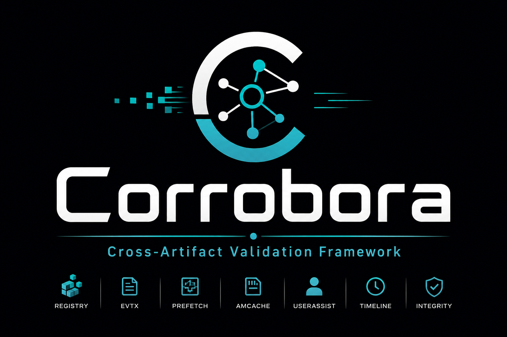

# Corrobora

Corrobora is a Python-based digital forensics framework for detecting
indicators of anti-forensic activity on Windows systems through
cross-artifact consistency analysis.

Rather than parsing a single artifact type in isolation, Corrobora
cross-references independent evidence sources -- Windows Event Logs
(EVTX), the Registry, Prefetch, and the NTFS Master File Table (MFT)
-- to surface disagreements between them that a single artifact alone
would never reveal: a program with execution evidence in Prefetch but
no corresponding EVTX log entry, registry persistence with no
supporting execution evidence at all, a Prefetch file whose name
doesn't match its own embedded hash, or a file whose timestamps show
signs of deliberate backdating (timestomping).

## Features

- **EVTX parser** -- structured extraction of Windows Event Log records,
  with per-record failure isolation and optional HTML report export.
- **Registry parser** -- recursive hive walking with full key/value
  extraction and LastWrite timestamp tracking.
- **Prefetch parser** -- execution history extraction, including
  filename/embedded-hash tamper detection.
- **MFT parser** -- a from-scratch NTFS binary parser (no third-party
  dependency) with built-in timestomping detection via
  $STANDARD_INFORMATION vs. $FILE_NAME comparison.
- **Correlation engine** -- a rule-based, fully deterministic (no AI/ML)
  engine that cross-references all four artifact types to surface
  anti-forensic indicators, ranked by severity.
- **Desktop GUI** -- a Tkinter application for running the full
  pipeline interactively, with live progress, sortable/filterable
  results, and HTML export.

## Installation

**Requirements:** Python 3.11 or later, on Windows (Corrobora's parsers are
built for Windows forensic artifacts specifically).

1. Clone the repository and move into it:

   ```powershell
   git clone https://github.com/Gear-I/Corrobora.git
   cd Corrobora
   ```

   (Already have the source some other way -- downloaded a zip,
   already working in a local copy, etc.? Skip straight to step 2,
   just make sure you `cd` into the folder that contains
   `pyproject.toml`.)

2. Confirm you're in the project's root folder -- the one that
   contains `pyproject.toml` directly (not inside `src/`):

   ```powershell
   dir pyproject.toml
   ```

   If `dir` doesn't find it, you're in the wrong folder -- fix that
   before continuing.

3. Install the project in editable mode. Note the trailing `.` --
   it means "install the project defined right here"; leaving it off
   causes a `-e option requires 1 argument` error.

   ```powershell
   pip install -e .
   ```

   This installs Corrobora's dependencies (`python-evtx`,
   `python-registry`, `libscca-python`) and registers the commands
   listed below.

4. Verify it installed correctly:

   ```powershell
   pip show Corrobora
   ```

   This should print real package metadata. If it says "Package(s)
   not found," step 3 didn't complete successfully -- scroll up in
   its output for the actual error.

| Command | What it does |
|---|---|
| `Corrobora-evtx` | Parse `.evtx` file(s) or a folder of them |
| `Corrobora-registry` | Parse a registry hive file |
| `Corrobora-prefetch` | Parse `.pf` file(s) or a folder of them |
| `Corrobora-mft` | Parse a raw `$MFT` file and detect timestomping |
| `Corrobora-correlate` | Run the full cross-artifact correlation engine |
| `Corrobora-case` | Auto-discover artifacts in a case folder or `.zip` |
| `Corrobora-gui` | Launch the desktop GUI |

For development (running the test suite and linters):

```powershell
pip install -e ".[dev]"
```

For progress bars during large EVTX parses:

```powershell
pip install -e ".[progress]"
```

### Running commands from any folder

By default, the commands above only work while your terminal is in
the same environment pip installed into. To run e.g. `Corrobora-gui`
from anywhere:

1. Find where pip put the scripts:

   ```powershell
   python -c "import sysconfig; print(sysconfig.get_path('scripts'))"
   ```

2. Add that folder to your Windows `PATH` (Start -> "Edit the system
   environment variables" -> Environment Variables -> select `Path`
   under User variables -> Edit -> New -> paste the folder path).

3. Open a **new** terminal window (PATH changes don't apply to
   already-open ones) and confirm:

   ```powershell
   where Corrobora-gui
   ```

   This should print a real path. If you installed into a virtual
   environment instead of your main Python, activate that
   environment first (`venv\Scripts\activate`) rather than adding
   it to your global `PATH`.

### If you have multiple Python versions installed

If `pip install -e .` fails with something like
`requires a different Python: 3.11.9 not in '>=3.12'`, either:

- Lower `requires-python` in `pyproject.toml` to `>=3.11` (the
  codebase doesn't use any Python 3.12-exclusive syntax), or
- Explicitly install with Python 3.12 if you have it available:
  ```powershell
  py -3.12 -m pip install -e .
  ```

## Usage

```bash
# Parse a single EVTX file
Corrobora-evtx Security.evtx

# Parse every .evtx file in a folder, with a progress bar
Corrobora-evtx "C:\Windows\System32\winevt\Logs" --progress

# Run full cross-artifact correlation
Corrobora-correlate --evtx Security.evtx --registry NTUSER.DAT \
    --prefetch "C:\Windows\Prefetch" --mft C_MFT

# Auto-discover artifacts in a case folder or zip, then analyze
Corrobora-case "C:\triage\case001" --analyze

# Launch the GUI
Corrobora-gui
```

## Running tests

```bash
pytest tests/ -v
ruff check src/
mypy src/Corrobora/parsers/
pylint src/Corrobora/parsers/*.py
```

## Design principles

- **No AI/ML.** Every detection rule is deterministic and explainable
  -- a finding can always be traced back to the exact fields and
  comparison that produced it.
- **Resilient parsing.** A single corrupted or unreadable record,
  file, or artifact never aborts an entire analysis run; failures are
  isolated, logged, and reported alongside successful results.
- **Testable by design.** Detection logic is decoupled from file I/O
  wherever possible, so rules and extractors can be (and are) unit
  tested against synthetic data without requiring real forensic
  images.

## Project status

This project is under active development. See `pyproject.toml` for a
note on the current flat-module package layout and a planned
namespaced-package refactor.

## Project History

 Corrobora was originally developed under the name **VeriTrace** as part of my master's capstone research. On August 7, 2026, the project was renamed to **Corrobora** to better reflect its mission of corroborating evidence across multiple Windows forensic artifacts and to establish a more distinctive identity within the open-source DFIR community.
 If you encounter references to **VeriTrace** in earlier blog posts, documentation, presentations, or research materials, they refer to what is now **Corrobora**. The project's goals, architecture, and development history remain the same; only the name has changed.


## License

MIT -- see `LICENSE`.
