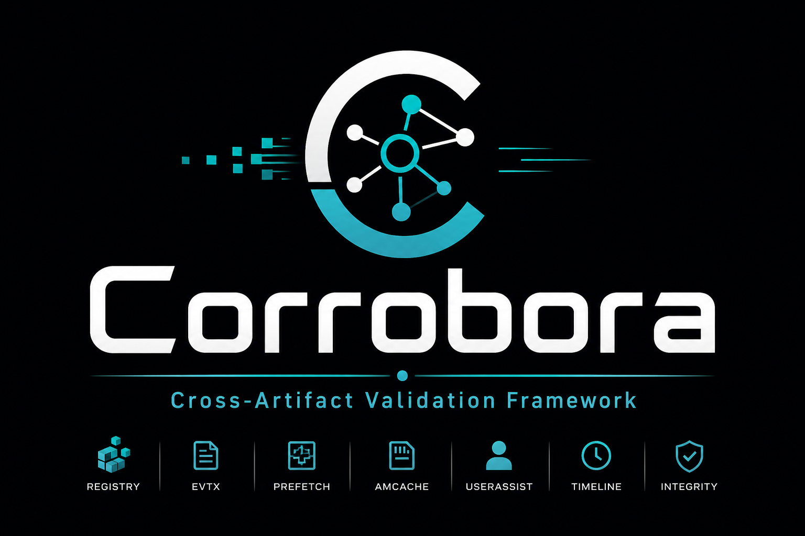

# Corrobora

Corrobora is a Python-based digital forensics framework that checks
whether independent Windows artifacts corroborate each other.

Rather than parsing a single artifact type in isolation, Corrobora
cross-references independent evidence sources -- Windows Event Logs
(EVTX), the Registry, Prefetch, and the NTFS Master File Table (MFT)
-- and reports where they agree and where they don't: whether
Prefetch, a process-creation event, and a BAM entry all place a
program's execution at the same time; a Prefetch file whose name
doesn't match its own embedded hash; or a file whose timestamps show
signs of backdating (timestomping).

A missing or disagreeing artifact is reported as a discrepancy for
examiner review, not as proof of tampering. Artifacts are routinely
absent for ordinary reasons -- auditing that is off by default, log
rollover, Prefetch eviction, or an incomplete collection -- so
Corrobora states what it compared and what it found, and leaves the
interpretation to the examiner.

## Features

- **EVTX parser** -- structured extraction of Windows Event Log records,
  with per-record failure isolation and optional HTML report export.
- **Registry parser** -- recursive hive walking with full key/value
  extraction and LastWrite timestamp tracking.
- **Prefetch parser** -- execution history extraction, including
  filename/embedded-hash mismatch detection.
- **MFT parser** -- a from-scratch NTFS binary parser (no third-party
  dependency) with built-in timestomping detection via
  $STANDARD_INFORMATION vs. $FILE_NAME comparison.
- **Program-execution corroboration** -- normalizes execution evidence
  from Prefetch, EVTX (Security 4688 / Sysmon 1), and Registry BAM/DAM
  into one common record, then reports whether the sources agree
  within an examiner-chosen time window: *Corroborated*, *Partially
  Corroborated*, or *Needs Review*, with a plain-language explanation.
  Run it with `Corrobora-corroborate`.
- **Correlation engine** -- a rule-based, fully deterministic (no AI/ML)
  engine that cross-references all four artifact types to surface
  discrepancies and anomalies for examiner review, ranked by severity.
- **Disk image support** *(optional)* -- point Corrobora directly at a
  raw forensic disk image (E01/EWF, VHD/VHDX, VMDK, or raw/dd) instead
  of an already-extracted folder; known artifacts are extracted
  straight out of the image's NTFS filesystem, no mounting required.
  Requires `pip install corrobora[images]`.
- **Desktop GUI** -- a PyQt5 application for running the full pipeline
  interactively: point it at one evidence source, choose which
  artifact and validation-rule categories to run, and browse
  sortable/filterable, scored results with automatic HTML export.
  Enter a correlation window next to **Process** to also run
  program-execution corroboration; selecting a program shows its full
  report and every evidence record.

## Installation

**Requirements:** Python 3.11 or later, on Windows, macOS, or Linux.
Corrobora analyzes artifacts *from* Windows systems, but the analysis
itself runs on any of the three, and CI runs the test suite on all of
them. The steps below use Windows commands; see
[docs/reproducible-testing.md](docs/reproducible-testing.md) for macOS
and Linux, and for a repeatable test that gives byte-identical output on
every platform.

1. Clone the repository and move into it:

   ```powershell
   git clone https://github.com/Gear-I/Corrobora.git
   cd Corrobora
   ```

   (Already have the source some other way -- downloaded a zip,
   already working in a local copy, etc.? Skip straight to step 2,
   just make sure you `cd` into the folder that contains
   `pyproject.toml`.)

2. Confirm you're in the project's root folder -- the one that
   contains `pyproject.toml` directly (not inside `src/`):

   ```powershell
   dir pyproject.toml
   ```

   If `dir` doesn't find it, you're in the wrong folder -- fix that
   before continuing.

3. *(Recommended)* Create and activate a virtual environment, so
   Corrobora and its dependencies are isolated from your other Python
   packages and its commands are on your `PATH` while the environment
   is active:

   ```powershell
   py -3.11 -m venv .venv
   .venv\Scripts\Activate.ps1
   ```

   In Command Prompt, activate with `.venv\Scripts\activate.bat`
   instead. Your prompt shows `(.venv)` while it's active; run the
   same activation command in each new terminal before using
   Corrobora. If PowerShell refuses to run the activation script,
   run `Set-ExecutionPolicy -Scope CurrentUser RemoteSigned` once, or
   use Command Prompt.

   Skipping this step also works, but the `corrobora-*` commands are
   then installed into your main Python's `Scripts` folder, which is
   often not on `PATH` (see "Running commands from any folder" below).

4. Install the project in editable mode. Note the trailing `.` --
   it means "install the project defined right here"; leaving it off
   causes a `-e option requires 1 argument` error.

   ```powershell
   pip install -e .
   ```

   This installs Corrobora's dependencies (`python-evtx`,
   `python-registry`, `libscca-python`) and registers the commands
   listed below.

5. Verify it installed correctly:

   ```powershell
   pip show Corrobora
   ```

   This should print real package metadata. If it says "Package(s)
   not found," step 4 didn't complete successfully -- scroll up in
   its output for the actual error.

| Command | What it does |
|---|---|
| `Corrobora-evtx` | Parse `.evtx` file(s) or a folder of them |
| `Corrobora-registry` | Parse a registry hive file |
| `Corrobora-prefetch` | Parse `.pf` file(s) or a folder of them |
| `Corrobora-mft` | Parse a raw `$MFT` file and detect timestomping |
| `Corrobora-correlate` | Run the full cross-artifact correlation engine |
| `Corrobora-case` | Auto-discover artifacts in a case folder, `.zip`, or disk image |
| `Corrobora-corroborate` | Check whether Prefetch, EVTX, and Registry (BAM/DAM) corroborate program execution |
| `Corrobora-gui` | Launch the desktop GUI |

For development (running the test suite and linters):

```powershell
pip install -e ".[dev]"
```

For progress bars during large EVTX parses:

```powershell
pip install -e ".[progress]"
```

For disk image support (E01/EWF, VHD/VHDX, VMDK, raw/dd):

```powershell
pip install -e ".[images]"
```

### Running commands from any folder

By default, the commands above only work while your terminal is in
the same environment pip installed into. To run e.g. `Corrobora-gui`
from anywhere:

1. Find where pip put the scripts:

   ```powershell
   python -c "import sysconfig; print(sysconfig.get_path('scripts'))"
   ```

2. Add that folder to your Windows `PATH` (Start -> "Edit the system
   environment variables" -> Environment Variables -> select `Path`
   under User variables -> Edit -> New -> paste the folder path).

3. Open a **new** terminal window (PATH changes don't apply to
   already-open ones) and confirm:

   ```powershell
   where Corrobora-gui
   ```

   This should print a real path. If you installed into a virtual
   environment instead of your main Python, activate that
   environment first (`venv\Scripts\activate`) rather than adding
   it to your global `PATH`.

### If you have multiple Python versions installed

If `pip install -e .` fails with something like
`requires a different Python: 3.11.9 not in '>=3.12'`, either:

- Lower `requires-python` in `pyproject.toml` to `>=3.11` (the
  codebase doesn't use any Python 3.12-exclusive syntax), or
- Explicitly install with Python 3.12 if you have it available:
  ```powershell
  py -3.12 -m pip install -e .
  ```

## Usage

```bash
# Parse a single EVTX file
Corrobora-evtx Security.evtx

# Parse every .evtx file in a folder, with a progress bar
Corrobora-evtx "C:\Windows\System32\winevt\Logs" --progress

# Run full cross-artifact correlation
Corrobora-correlate --evtx Security.evtx --registry NTUSER.DAT \
    --prefetch "C:\Windows\Prefetch" --mft C_MFT

# Auto-discover artifacts in a case folder or zip, then analyze
Corrobora-case "C:\triage\case001" --analyze

# Or point it straight at a disk image instead (requires the 'images' extra)
Corrobora-case "C:\evidence\case001.E01" --analyze

# Check whether independent sources corroborate PowerShell execution.
# --window is required: there is no validated default.
Corrobora-corroborate "C:\triage\case001" --window 300 --subject powershell.exe

# Or summarize every program with execution evidence
Corrobora-corroborate "C:\triage\case001" --window 300

# Launch the GUI
Corrobora-gui
```

## Running tests

```bash
pytest tests/ -v
ruff check src/
mypy src/Corrobora/parsers/
pylint src/Corrobora/parsers/*.py
```

## Design principles

- **No AI/ML.** Every rule is deterministic and explainable
  -- a finding can always be traced back to the exact fields and
  comparison that produced it.
- **Resilient parsing.** A single corrupted or unreadable record,
  file, or artifact never aborts an entire analysis run; failures are
  isolated, logged, and reported alongside successful results.
- **Testable by design.** Detection logic is decoupled from file I/O
  wherever possible, so rules and extractors can be (and are) unit
  tested against synthetic data without requiring real forensic
  images.

## Status and limitations

Corrobora is **alpha software** (0.1.x) under active development.
Output formats, commands, and APIs may change between releases.

**Not validated for evidentiary use.** Results are leads for examiner
review, not conclusions. Verify anything that matters against the
source artifacts, e.g. with `Corrobora-corroborate --list-evidence`,
which lists every record behind a result.

What has and hasn't been tested:

- **Real-data testing so far is one controlled test on one machine**
  (Windows 11 Home, build 26200): `powershell.exe` run three times at
  known times, then compared against Prefetch, the Security log (4688),
  and BAM. The measured offsets are documented on `TimestampSemantics`
  in `src/corrobora/models/evidence.py`. Other Windows versions and
  builds are untested.
- **The correlation window has no validated value.** On the test
  machine, start-time sources agreed within about 30 ms, but that is
  one machine, not a general threshold. The window is a required
  argument and every report says so.
- **Sysmon Event ID 1 extraction** is tested only against synthetic
  events, not real Sysmon logs.

Known limitations of the evidence itself:

- **Security 4688 needs process-creation auditing**, which is off by
  default on Windows. Without it, the Security log contains no
  execution evidence.
- **Prefetch** keeps only the eight most recent runs per program and is
  disabled by default on Windows Server. Prefetch files with fewer than
  eight recorded runs have not yet been tested.
- **BAM** keeps only the most recent exit time per user and program, so
  it can support at most one run.
- By default `Corrobora-corroborate` reads only Security and Sysmon
  logs; use `--all-evtx` to parse every `.evtx` file.

Scope:

- **Program-execution corroboration** currently uses Prefetch, Security
  4688, Sysmon Event ID 1, and Registry BAM/DAM. MFT, Amcache, and
  UserAssist are not yet evidence sources for it.
- It runs from `Corrobora-corroborate` and, when a correlation window
  is entered, from the GUI's **Program Execution Corroboration** panel.
  The GUI's HTML report export does not yet include its results.
- The older rules and the GUI's **Application Corroboration** scores
  match executable names by substring in EVTX event text and registry
  value data. This is a heuristic: it can miss names that appear only
  in unparsed fields (it does not find BAM entries, whose path is the
  value *name*), and can over-match short names. The two GUI panels can
  therefore disagree about the same program; the Program Execution
  panel reads structured fields and is the more precise of the two.

## Project History

 Corrobora was originally developed under the name **VeriTrace** as part of my master's capstone research. On August 7, 2026, the project was renamed to **Corrobora** to better reflect its mission of corroborating evidence across multiple Windows forensic artifacts and to establish a more distinctive identity within the open-source DFIR community.
 If you encounter references to **VeriTrace** in earlier blog posts, documentation, presentations, or research materials, they refer to what is now **Corrobora**. The project's goals, architecture, and development history remain the same; only the name has changed.


## License

MIT -- see `LICENSE`.
